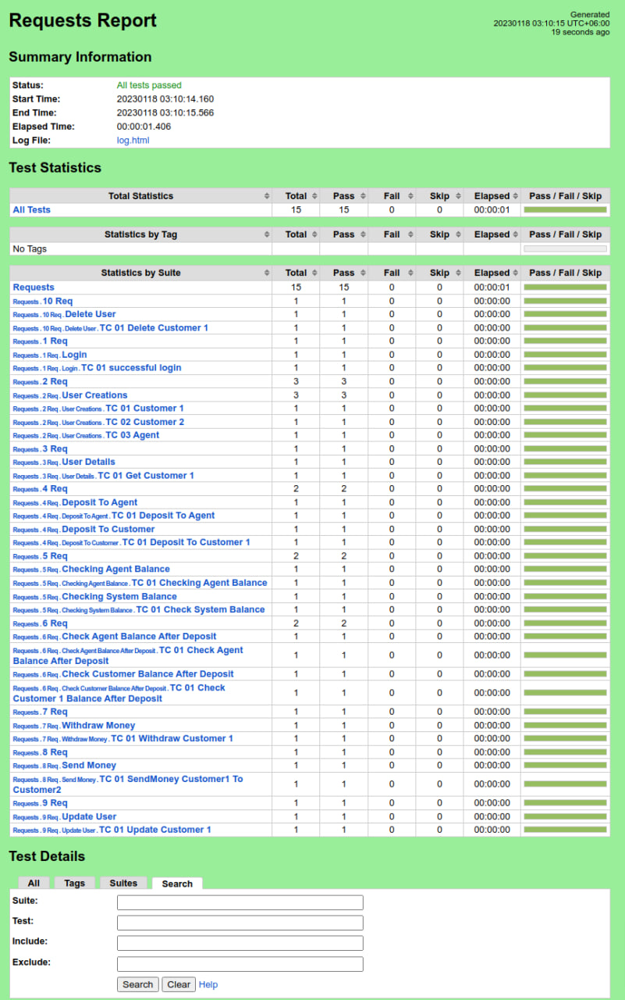

# API Automation Using RobotFramework

---
This project uses RobotFramework to automate [DMoney API](http://dmoney.roadtocareer.net/)


### [Test Scenarios](https://github.com/md-mostafa/DMONEY_API_Automation_using_Robot/tree/main/Requests)
- [Login as admin.](https://github.com/md-mostafa/DMONEY_API_Automation_using_Robot/blob/main/Requests/1_Req/Login/TC_01_successful_login.robot) 
- [User creations.](https://github.com/md-mostafa/DMONEY_API_Automation_using_Robot/tree/main/Requests/2_Req/User_Creations)
- [Get user details.](https://github.com/md-mostafa/DMONEY_API_Automation_using_Robot/tree/main/Requests/3_Req/User_Details)
- [Deposit to agent/customer.](https://github.com/md-mostafa/DMONEY_API_Automation_using_Robot/tree/main/Requests/4_Req)
- [Check user balance.](https://github.com/md-mostafa/DMONEY_API_Automation_using_Robot/tree/main/Requests/5_Req)
- [Money withdrawal.](https://github.com/md-mostafa/DMONEY_API_Automation_using_Robot/tree/main/Requests/7_Req/Withdraw_Money)
- [Send money.](https://github.com/md-mostafa/DMONEY_API_Automation_using_Robot/tree/main/Requests/8_Req/Send_Money)
- [Update user.](https://github.com/md-mostafa/DMONEY_API_Automation_using_Robot/tree/main/Requests/9_Req/Update_User)
- [Delete user](https://github.com/md-mostafa/DMONEY_API_Automation_using_Robot/tree/main/Requests/10_Req/Delete_User)


### Prerequisites
- **Tool:** Robot Framework
- **IDE:** Pycharm IDE
- **Framework:** Robot

### How to run the project
1. Clone the repo
2. Open cmd in the root folder
3. Give the following commands :
 ```
 robot Requests
 ```


### Generated reports



---
### Feedback
If you have any feedback, please reach out to me at md.mostafa.akash@gmail.com

